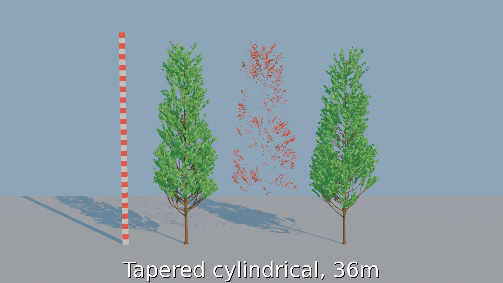

# Tree Generation Parameter Estimation from Point Clouds

### Abstract
3D scans of the environment have become more and more common in the recent years with drones, UAVs and autonomous cars becoming more accessible. But the generated point clouds are not interpretable so they are usually transformed into some other type of data. One particular area of reconstruction is the reconstruction of vegetation or trees. 
In this paper I tackle the reconstruction of trees from an arial scan. I create a synthetic dataset of trees using Blender and simulate an aerial LiDAR scan to create their point clouds. After the creation of the dataset, PointNet++ is used to predict the most important parameters of the trees which can be used for their reconstruction. I also create a simple Blender add-on to test the capabilities of the model. On test set the model achieves great results with 98.0\% accuracy on the classification parameter, while the qualitative results show that the reconstruction of the trees from the point cloud creates similar looking trees to the original.

### Dataset
The dataset is available [here](https://drive.google.com/drive/folders/1JOrb_KYhFZtL_l2wNDouisAKmAfrwr-Q?usp=sharing), named _dataset_. You can download, extract and add it to the root folder of this project.

### Add-on
Add-on can be installed through Blender by installing the _tree\_parameter\_estimation\_add-on.zip_.

Below is a video showing the use of add-on.

### Qualitative results
On the left is the original tree, in the middle is the created point cloud and on the right is the tree that was generated by the model from the point cloud. On the left if also a tower of red and white cubes which shows the scale of the trees. Each cube has a length of 1 meter. On the bottom is also a text with the tree crown shape and the approximate tree height.
